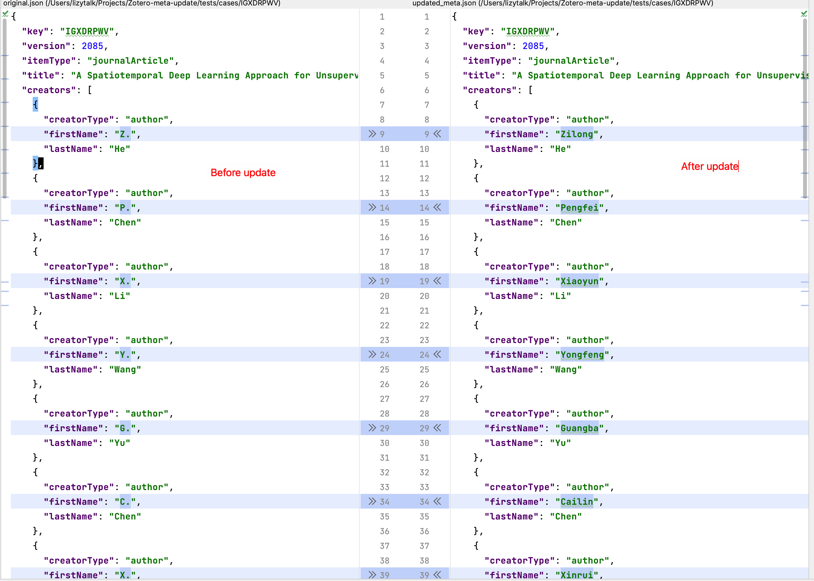
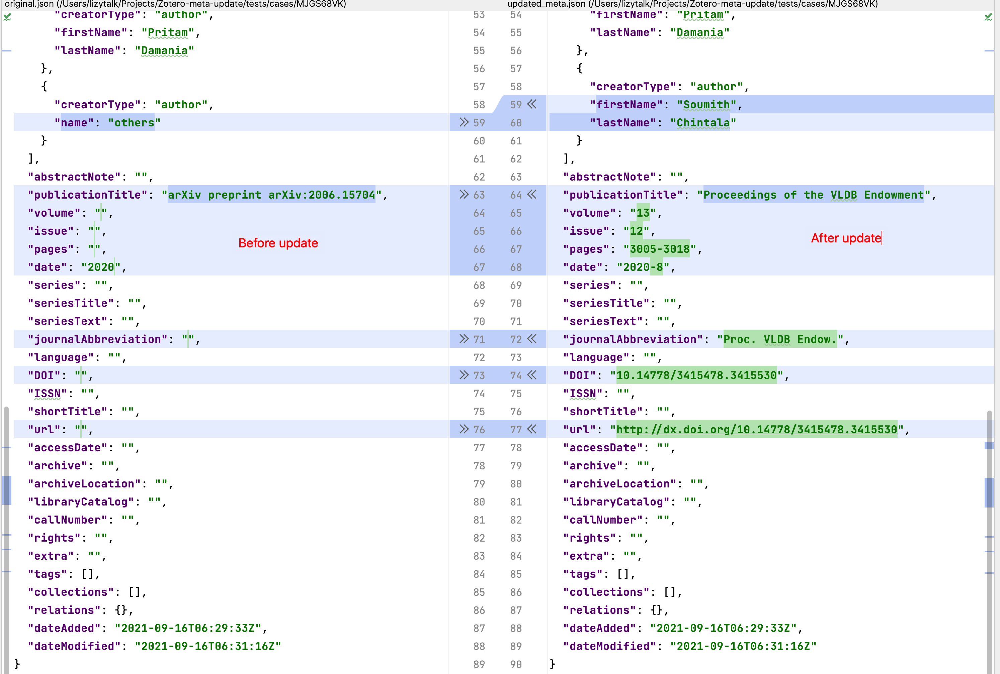

# Zotero-meta-update
* [Examples](#Usage)
* [Usage](#Usage)
* [Roadmap](#Usage)

[](https://coveralls.io/github/lizeyan/Zotero-meta-update?branch=dev)

Though Zotero is a great tool for managing references, the metadata of your library items can be wrong for different reasons:
1. You got the PDF file before it is formally published (e.g., from the authors' personal site or Arxiv), and the metadata is not updated yet.
2. I found Zotero often cannot retrieve the correct metadata for some papers, especially for those published in conference proceedings.
## Examples



## Usage
1. Write your Zotero user ID to a file named `ZOTERO_USER_ID` (get it from https://www.zotero.org/settings/keys)
2. Write your Zotero API key to a file named `ZOTERO_API_KEY` (get it from https://www.zotero.org/settings/keys)
3. ``` bash
   python3 update_zotero_meta.py --help  # show helps
   python3 update_zotero_meta.py  # run
   ```


## Roadmap
- [x] Search items with title, DOI, and author names from the original item metadata on databases (including CrossRef, DBLP, etc.) and update the metadata of the item.
  - Supported databases:
    - [x] CrossRef
    - [x] DBLP
  - Supported item types:
    - [x] Conference paper
    - [x] Journal articles
    - [ ] Arxiv papers (informal publications) (They are quite common for me).
- [ ] Manually select the correct item from the search results when there are multiple matches (currently I raise an exception in such cases).
- [ ] There could be errors in the databases, e.g., https://api.crossref.org/works/10.1145/2465529.2465753 (conference name)